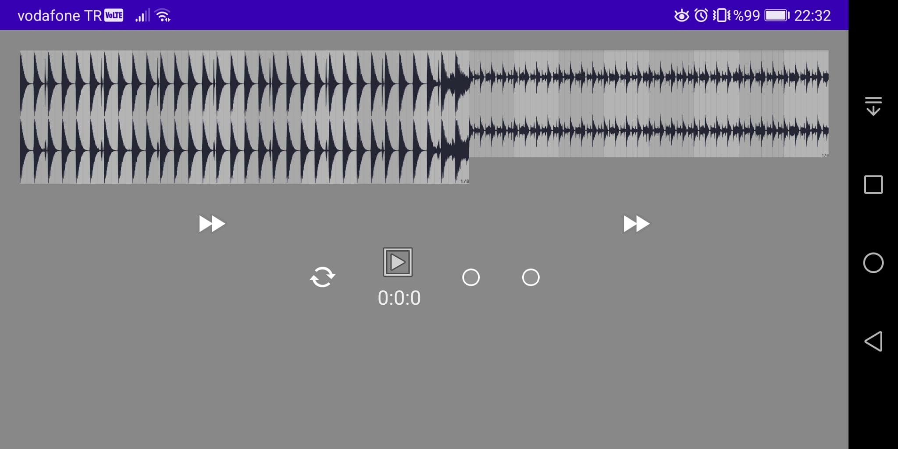

# Skoove Challenge

- Implemented and Tested on Huawei Mate 10 Pro API 29

## Left TODO

- Keep the sync while changin tracks
- Add vertical bars to show current play position
- Microloops
- Improve UI responsiveness and fix MediaPlayer device related bugs

## Tech

Application uses the following libraries and etc. :

- [Jetpack Compose] - Library for Drawing UI
- [Coroutines] - Library for async taks
- [Coil] - Library for async image loading to compose.

## Installation

Download the code and run.

## 📱 Screenshots

  

